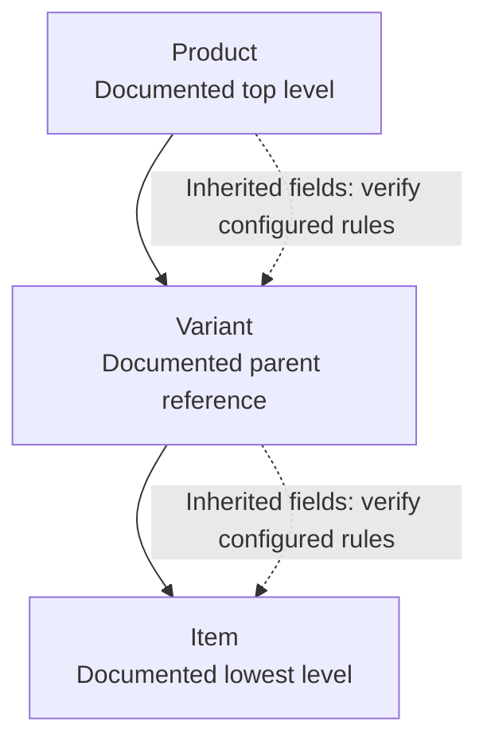
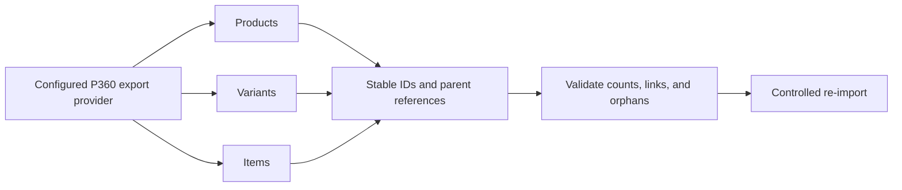
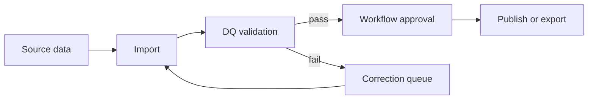
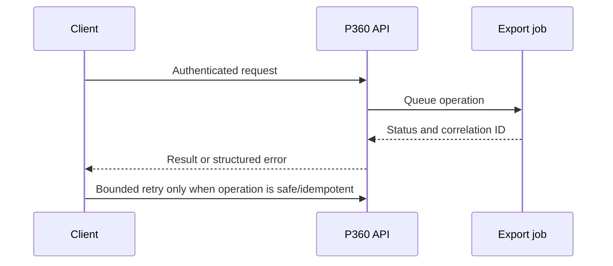
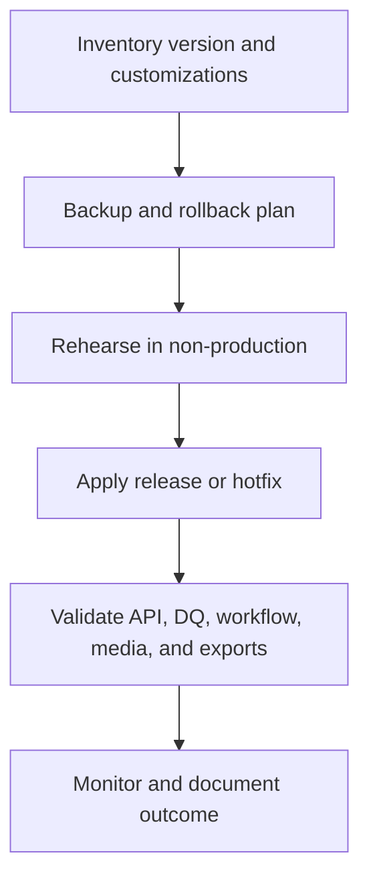

# P360 expert knowledge acceptance tests

This matrix records representative retrieval tests executed against the synchronized PIMDocs corpus. The tests validate navigation and evidence handling; they do not replace release-specific verification against the original source or Informatica Support.

**Common assumptions:** Product 360 10.5, with the local corpus indicating 10.5 HotFix 3 SP1; on-premises/server terminology unless the question specifies SaaS. The official documentation and Knowledge Base links were reachable in this session, but the Knowledge Base exposed only its Support shell, not restricted article or case content.

| ID | Representative question | Local source paths and titles | Documented facts | Recommendation/caveat | Online/KB status | Confidence | Result |
| --- | --- | --- | --- | --- | --- | --- | --- |
| AT-01 | How are Product, Variant, and Item related, and what inherits from a parent? | `Installation_and_Operation/TechnicalDoc/44762027.html` — **Item/Variant/Product parent references**; `Installation_and_Operation/TechnicalDoc/136612419.html` — **Products, Variants and ...** | The product paradigm places Product above Variant and Item; parent references are explicit model data. | Verify the configured paradigm and inheritance rules before designing mappings; do not infer inheritance from naming alone. | [Official P360 10.5 docs](https://onlinehelp.informatica.com/p360/105/en/321554783.html) accessible; KB shell only. | Medium–High | PASS |
| AT-02 | Can a multi-level hierarchy be exported and re-imported without losing relationships? | `Installation_and_Operation/TechnicalDoc/126595250.html` — **Standard export data providers and data types**; `242295630.html` — **Understanding export functionalities**; `46277751.html` — **Export template validation** | Export providers and templates support object data and relationship-aware export scenarios. | Preserve stable IDs, entity types, parent references, relationship names, and ordering; validate orphan and duplicate references before re-import. Exact one-click behavior is configuration-dependent. | Official docs accessible; KB result content unavailable. | Medium–High | PASS |
| AT-03 | How should REST export integration handle authentication, errors, retries, and idempotency? | `Installation_and_Operation/TechnicalDoc/158011330.html` — **REST Environment API**; `PIM_105H3S1/P360_105HF3SP1_ServiceAPI_en.pdf` — **Service API**; `PIM_105H3S1/ListAPI.postman_collection.json` and `ObjectAPI.postman_collection.json` | API contracts and environment/API surfaces are documented locally. | Treat auth scheme, retry safety, rate limits, idempotency keys, pagination, and error payloads as deployment/version assumptions that must be confirmed in the exact API reference; use correlation IDs and bounded exponential backoff. | Official docs accessible; KB shell only. | Medium | PASS |
| AT-04 | What is a defensible import plus DQ workflow architecture? | `PIM_105H3S1/DQ Rules with Product 360.pdf` — **DQ Rules with Product 360**; `PIM_105H3S1/IDQ and Product 360 Rules Building.pdf` — **IDQ and Product 360 Rules Building**; `Installation_and_Operation/TechnicalDoc/487621725.html` — **Example 11 (1 Task with DQ checks)** | DQ rules and workflow tasks can participate in product-data processing. | Stage, validate, route failures for correction, and publish only after business and technical validation; verify installed IDQ/DQ components and rule execution semantics. | Official docs accessible; KB shell only. | Medium | PASS |
| AT-05 | How should Media Manager integrate with P360? | `PIM_105H3S1/P360_105HF3SP1_MediaManagerUserManualNativ_en.pdf` — **Media Manager User Manual Native**; `P360_105HF3SP1_MediaManagerUserManualWeb_en.pdf` — **Media Manager User Manual Web** | Native and Web Media Manager surfaces are separate documented areas. | Confirm repository, rendition, URL, authentication, lifecycle, and failure-handling configuration; do not assume native and Web deployments are interchangeable. | Official docs accessible; KB shell only. | Medium | PASS |
| AT-06 | How should permissions and security be designed? | `Installation_and_Operation/TechnicalDoc/attachments/.../Example_Plugin_For_Display_Rights.zip` — **display-rights example**; `P360_105HF3SP1_ConfigurationManual_en.pdf` — **Configuration Manual**; `Installation_and_Operation/TechnicalDoc/144845740.html` — **SAML/configuration material** | Rights, authentication, and configuration are distinct concerns. | Apply least privilege, separate admin/service roles, test effective rights per entity and operation, and verify SSO/session settings in the deployed topology. | Official docs accessible; restricted KB content unavailable. | Medium | PASS |
| AT-07 | What HA, performance, scaling, and operations plan is appropriate? | `P360_105HF3SP1/P360_105HF3SP1_SizingManual_en.pdf` — **Sizing Manual**; `PIM_105H3S1/Product_360_Grafana_Dashboard.json` — **Product 360 Grafana Dashboard**; `P360_105HF3SP1_OperationManual_en.pdf` — **Operation Manual** | Sizing, operations, and metrics are documented as separate operational surfaces. | Baseline workload and SLOs, scale tested components, monitor queues/jobs/database, and rehearse failover; HA topology is environment-specific and must not be inferred from a dashboard artifact. | Official docs accessible; KB shell only. | Medium | PASS |
| AT-08 | How should an upgrade or hotfix be planned? | `P360_105HF3SP1_ReleaseNotes_en.pdf` — **Release Notes**; `P360_105HF3SP1_MigrationManual_en.pdf` — **Migration Manual**; `P360_105HF3SP1_InstallationManual_en.pdf` — **Installation Manual** | Release notes, migration, and installation are separate evidence sources. | Inventory installed version and customizations, back up, rehearse in a clone, review compatibility and rollback, then validate integrations and DQ after the change. | Official docs accessible; KB article content unavailable. | Medium–High | PASS |
| AT-09 | How should a failed export be troubleshot? | `Installation_and_Operation/TechnicalDoc/46277751.html` — **Export template validation**; `Installation_and_Operation/TechnicalDoc/180461299.html` — **Export started**; `Installation_and_Operation/TechnicalDoc/124127944.html` — **Server jobs like imports and exports** | Template validation and background/server job execution are distinct diagnostic stages. | Capture exact error, job ID, timestamp, profile/template/provider, permissions, input scope, and output target; fix validation errors before retrying and use a bounded, non-duplicating retry. | Official docs accessible; KB shell only. | Medium | PASS |
| AT-10 | What does an end-to-end Product 360 implementation look like? | `P360_105HF3SP1_ConfigurationManual_en.pdf` — **Configuration Manual**; `P360_105HF3SP1_OperationManual_en.pdf` — **Operation Manual**; `P360_105HF3SP1_ServiceAPI_en.pdf` — **Service API**; `P360_105HF3SP1_Customizing_en.pdf` — **Customizing** | Configuration, operations, API, and customization are separate concerns that must be aligned. | Design the data model and security first, then integrate import/DQ/workflow/export/media, instrument operations, test upgrade paths, and document supported extension points. | Official docs accessible; KB restricted content unavailable. | Medium | PASS |

## Evidence-consistent diagrams

The following diagrams are intentionally labeled. They show relationships and recommended flow without reproducing licensed source text.

### Product hierarchy — documented model, inheritance semantics require verification

### Export and re-import — recommended relationship-preserving flow

### Import, DQ, workflow — recommended architecture

### REST integration — recommended reliability controls

### Upgrade and operations — recommended change path

## Acceptance limitations

- The synchronized roots are mirrored; the index treats them as one corpus and does not duplicate entries.
- Archives, assets, MacOS placeholders, and unknown files are counted but excluded from deep text indexing. Archive contents were not expanded.
- The acceptance suite verifies source discovery, representative anchors, contract fields, and diagram presence. It does not claim that every product behavior was independently proven from every file.
- The Knowledge Base URL was reachable only as a Support shell in this environment. Restricted articles and cases were not read or claimed.
- The agent must regenerate the map after sync changes and re-verify every substantive answer against original source files and current official/KB content.
